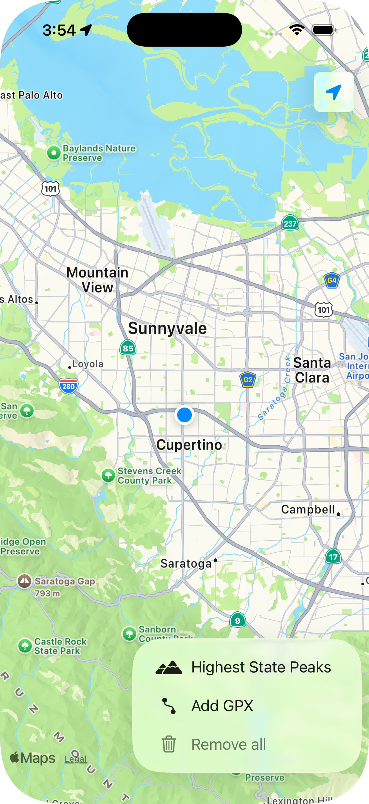
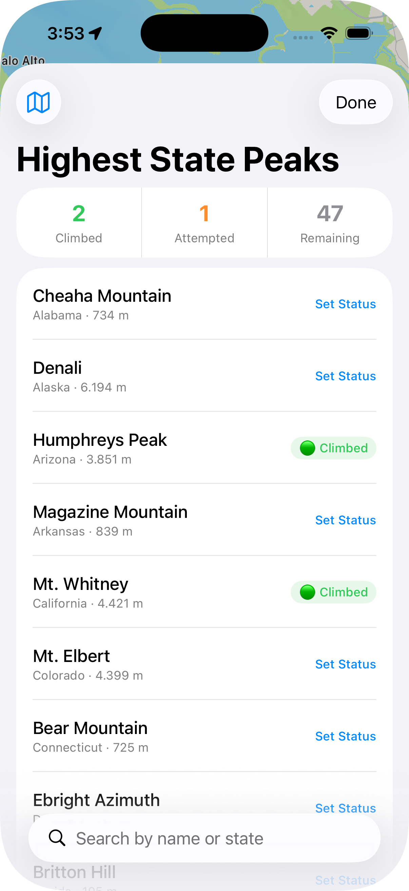

# MapViewer

An iOS app that I use to keep track of my hiking trails. Allows to import GPX tracks and visualize them on a map, and log your progress against the highest peak in every US state.

## Features

**GPX Tracks**
- Import one or more `.gpx` files to overlay your trails on the map
- Tap a trail to see its name and total distance
- Tracks are saved between sessions

**Highest State Peaks**
- Browse all 50 US state high points with elevation in meters
- Search by peak name or state
- Mark each peak as *Attempted* or *Climbed* — your progress is saved automatically
- Summary counts (Climbed / Attempted / Remaining) at a glance
- Toggle peak markers on and off directly from the map

## Screenshots

  
  &nbsp;&nbsp;&nbsp;&nbsp;
  

